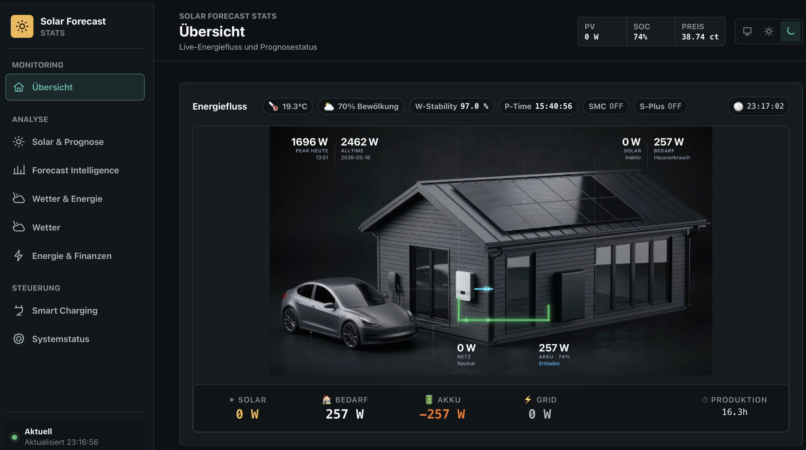
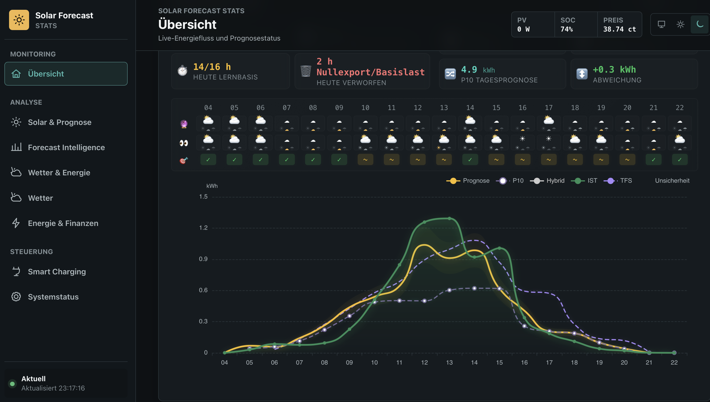
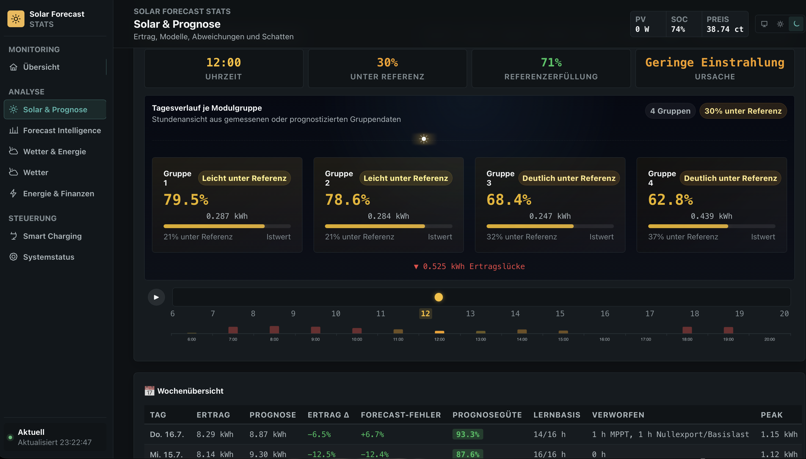
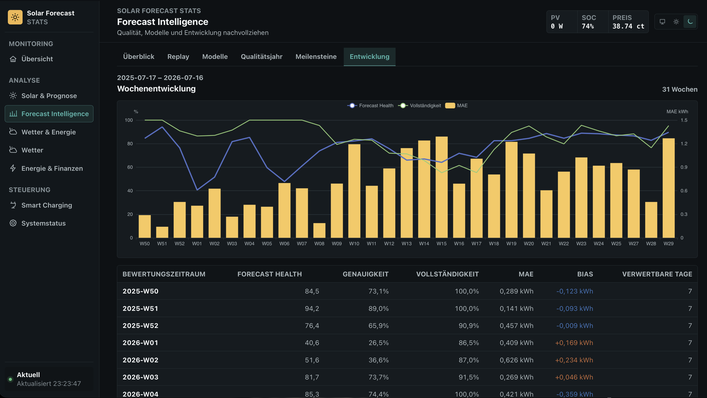
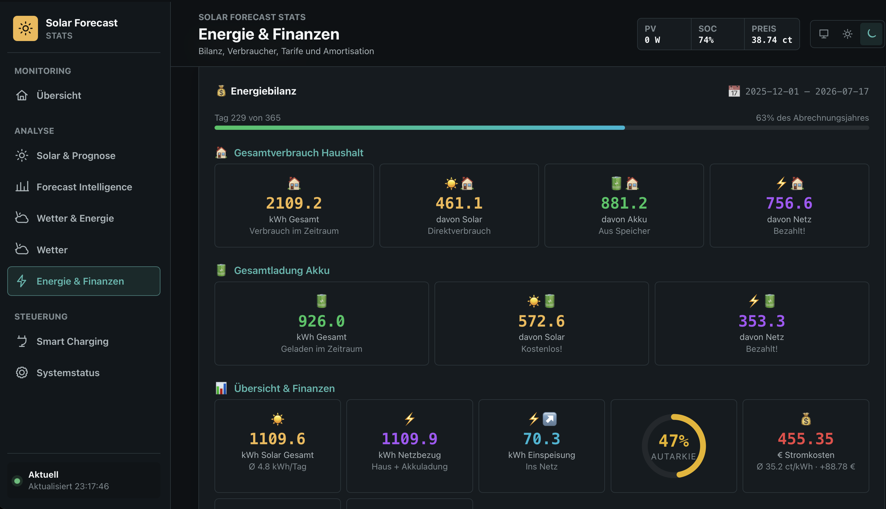
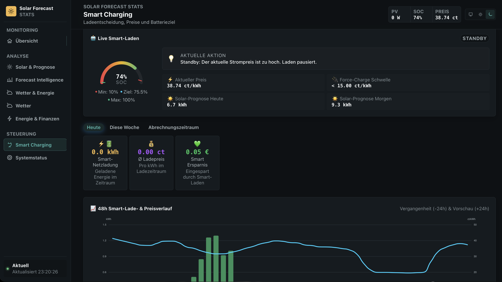

  

<h1 align="center">Solar Forecast ML</h1>

  <strong>The first and only Home Assistant integration that forecasts solar production with a local AI — a transformer with attention, running on your own hardware</strong>

  <em>Your data. Your property. 
  Nothing leaves your Home Assistant. No external AI.</em>

  
  
  
  
  
  

> [!IMPORTANT]
> ### Documentation lives on the website
>
> **[solarforecastml.com](https://solarforecastml.com/en/)** is the authoritative source for everything: what each component does, which sensors you need, installation, troubleshooting, known bugs, and release notes.
>
> **[Is SFML right for me?](https://solarforecastml.com/en/suitability/)** · **[Installation](https://solarforecastml.com/en/installation/)** · **[Sensors](https://solarforecastml.com/en/sensors/)** · **[Help](https://solarforecastml.com/en/docs/)** · **[Bug tracker](https://solarforecastml.com/en/bugs/)** · **[Updates](https://solarforecastml.com/en/updates/)**

  <strong>Fuel my late-night ideas with a coffee? I'd really appreciate it — it keeps this project running.</strong>

  

---

## Not another solar forecast

Every solar forecast tells you what a roof like yours should produce. This one learns what *your* roof actually does — and it learns it on your own hardware.

Solar Forecast ML runs a complete AI stack inside Home Assistant: it trains on your measurements, corrects itself against your weather, and reports how good it currently is. No cloud service calculates your forecast. No language model reads your data. Nothing is uploaded, not even to me as the developer.

That is the difference. Not a better formula — a system that knows your installation and keeps that knowledge where it belongs.

**What no other Home Assistant integration offers today:**

- **A local AI that forecasts solar production.** Every other solar integration either queries a cloud service or applies a static formula. None of them runs its own learning model on your hardware.
- **A transformer with attention as a Home Assistant integration.** Not an API call to a remote model — the architecture itself runs inside Home Assistant, within the resource limits of a home server, without TensorFlow or PyTorch.
- **A model pre-trained on multi-year weather and climate data.** It does not start from zero on your roof. It starts with an understanding of weather, and then learns your installation on top of it.
- **Complete data ownership.** Your production data, your sensor readings, your location, your learned model — all of it stays on your system. Not with a cloud provider, not with a language model, not with me.

---

## What it does

A cloud forecast knows tilt, orientation and kilowatt-peak. It does not know the tree that shades your roof from 3 p.m. in winter, the fog in your valley, your second array facing west, or the inverter that caps at 4 kW.

Solar Forecast ML builds a **digital twin of your system** instead: solar physics, weather data, your system geometry and your own measurements become an hourly forecast for today, tomorrow and the day after — recalculated every morning on your Home Assistant hardware.

It gets better with every day of data, because it learns from your installation rather than a reference one. And it tells you how good it currently is: accuracy, deviation, usable data days, long-term trends. No subscriptions, no telemetry, no cloud training.

Live view with the optional STATS module: solar, household demand, battery, grid and forecast status in one place.

---

## Is it right for you?

**Required:** a DC power sensor for your panels — the power arriving at the inverter, not the inverter's AC output. With a battery, a PV-to-battery sensor as well. Without these values SFML cannot work, and there is no way around it.

**Also needed:** your system data (capacity in kWp, orientation, tilt per panel group), Home Assistant 2026.3.0 or newer, and some willingness to understand your own PV system.

**Not suitable for:** systems without a DC power reading, AC-coupled battery systems, or anyone looking for a one-click product.

The website has the [full suitability check](https://solarforecastml.com/en/suitability/) for every component, including the effort each one takes.

---

## What you see

Forecast and measured production hour by hour, with weather context, learning basis and the hours that were excluded — and why.

Every panel group stays visible on its own: who delivers as expected, who falls behind, how large the gap is — plus the shading pattern learned for your roof.

Forecast quality over time: accuracy, completeness, deviation, usable days and long-term trends. Model development stays auditable instead of being a promise.

 

<table>
  <tr>
    <td width="50%"></td>
    <td width="50%"></td>
  </tr>
  <tr>
    <td align="center"><strong>Energy &amp; finance</strong> Where your energy comes from, what it costs, what you saved.</td>
    <td align="center"><strong>Smart charging</strong> Grid charging planned from price, forecast and battery state.</td>
  </tr>
</table>

The views above come from the optional STATS module. SFML itself provides the forecast and its sensors to Home Assistant.

---

## What makes it different

| | Cloud forecasts | Solar Forecast ML |
|---|---|---|
| **Where it runs** | Remote service | Entirely on your hardware |
| **Basis** | A typical installation | Your measurements, your roof |
| **Shading** | Not covered | Learned, including seasonal change |
| **Environment** | Ignored | Snow, fog, haze, air mass and altitude |
| **Inverter limits** | Unknown | Clipping and curtailment recognised and excluded from learning |
| **Quality** | Stated | Measured, shown and traceable |
| **Your data** | Sent to a service | Stays in your home |

Two AI stacks carry the system: **Hubble** for the solar forecast, **Kepler** for energy decisions in the companion modules. Both run locally inside Home Assistant. If the methods behind a forecast disagree, solar physics takes over — so the result stays dependable even in unusual weather.

---

## Highlights

Five capabilities that make the difference in daily operation. Each one has a page of its own with screenshots and the reasoning behind it:

| | What it does for you |
|---|---|
| **[The forecast](https://solarforecastml.com/en/highlights/local-forecast/)** | Hourly for 72 hours, learned from your roof: shading, local weather, panel groups — and the forecast quality is measured, not claimed. |
| **[Smart Charge](https://solarforecastml.com/en/highlights/smart-charge/)** | Charges the battery from the grid when electricity is cheap and the sun will not be enough — and leaves room for solar power otherwise. |
| **[Hubble energy copilot](https://solarforecastml.com/en/highlights/hubble-copilot/)** | Reads your energy data and answers in plain sentences: what is worth doing today, how reliable the forecast is, whether the battery will last. |
| **[Energy &amp; finance](https://solarforecastml.com/en/highlights/energy-finance/)** | Where your energy comes from, which device consumes it, what a kilowatt-hour really costs — and when the system has paid for itself. |
| **[Kepler energy management](https://solarforecastml.com/en/highlights/kepler-ems/)** | House, heat pump, storage and car all want the sun. Kepler distributes it in a fixed order and explains every recommendation. |

Smart Charge, Hubble, Energy &amp; finance and Kepler come with the companion modules below. The forecast is SFML itself.

---

## Companion modules

SFML works standalone. These build on top of it and are installed through the `install_extras` service:

| Module | What it adds | Platform |
|---|---|---|
| **Solar Forecast STATS** | The complete energy workspace: live flows, forecast evaluation, weather history, energy balance, costs, battery and smart charging | x86_64 |
| **Solar Forecast Energy AI** | Explainable recommendations for heat pump, storage and wallbox. Advisory only — it never switches a device (licensed) | x86_64, ARM64 |
| **Grid Price Monitor** | Dynamic electricity prices, time-of-use tariffs, real total price per kWh | all |

Details and screenshots: [solarforecastml.com](https://solarforecastml.com/en/product/)

---

## Installation

**Via HACS (recommended)**

1. HACS → Integrations → Custom repositories
2. Add `https://github.com/Zara-Toorox/ha-solar-forecast-ml` as category *Integration*
3. Install **Solar Forecast ML**
4. Restart Home Assistant, wait 10–15 minutes, restart once more
5. Add the integration under Settings → Devices & Services

**Manually:** download the release, copy it to `config/custom_components/solar_forecast_ml`, restart twice as above.

During setup you provide the power sensor, orientation, tilt and capacity for each panel group, plus your total system capacity. Daily-reset energy helpers are not required — SFML derives hourly and daily energy from the configured power sensors and keeps its own validated state.

The [installation guide](https://solarforecastml.com/en/installation/) walks through every step, including the optional modules.

---

## Licence for Energy AI

Solar Forecast Energy AI ships with SFML and is unlocked with a signed offline key. Information on obtaining a licence is available **inside Solar Forecast STATS via the "Licence" entry in the sidebar**.

The key is entered once at the start of the EAI configuration flow. Validation happens entirely offline inside Home Assistant: no licence server is contacted, and neither the key nor any household data is transmitted. Keep your key private and never post it publicly.

---

## Your data stays yours

**No language models are involved.** There is no connection to ChatGPT, Claude, Gemini or any other AI service. Every calculation and every learning step happens inside your own Home Assistant instance.

**No telemetry, no analytics, no tracking.** The integration contains no usage tracking, no error reporting endpoints and no background callbacks. I cannot see whether you installed it, how you use it, or what your system produces.

**Nothing is shared.** Production data, sensor readings, location and learned model state never leave your system — not to me, not to third parties.

**Weather requests only.** Public weather APIs are queried with coordinates alone: no personal data, no identifiers, no usage metadata. Once configured, everything else works without an internet connection.

---

## Protected code

Parts of this integration are protected with PyArmor. The reasons: preventing the source from being used for AI training without permission, protecting work that took considerable effort, and responding to code having been copied into commercial products in the past.

Protection does not change behaviour — the integration works exactly like an unprotected build, with minimal runtime overhead. If you have a legitimate interest in details about the code, contact me via GitHub Issues or Discussions.

---

## Licence and credits

Proprietary Non-Commercial — free for personal and educational use. See [LICENSE](LICENSE). The repository licence is separate from the EAI activation key.

**Developer:** [Zara-Toorox](https://github.com/Zara-Toorox)

SFML is a private project. It is discussed in several independent communities; none of them belongs to the project, and the website is the authoritative source. Thanks to everyone testing, reporting and discussing — your feedback shapes every release.

[Issues](https://github.com/Zara-Toorox/ha-solar-forecast-ml/issues) · [Discussions](https://github.com/Zara-Toorox/ha-solar-forecast-ml/discussions) · [Bug tracker](https://solarforecastml.com/en/bugs/)
